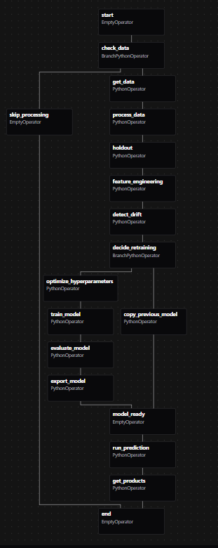

# Documentación del Pipeline Productivo SodAI Drinks

## Descripción General

Este pipeline de **Apache Airflow** implementa un sistema completo de machine learning para predecir compras de productos por parte de clientes. El sistema está diseñado para manejar datos incrementales y reentrenar automáticamente cuando se detecta drift.

El pipeline implementa un enfoque robusto que evita data leakage mediante el cálculo de estadísticas exclusivamente con datos de entrenamiento, garantizando la reproducibilidad y consistencia entre el entrenamiento y las predicciones en producción.

---

## Arquitectura del DAG

### **Diagrama de Flujo**

```mermaid

    A[start] --> B[check_data]
    
    %% Flujo principal si hay datos
    B --> C[get_data]
    C --> D[process_data]
    D --> E[holdout]
    E --> F[feature_engineering]
    F --> G[detect_drift]
    G --> H[decide_retraining]
    
    %% Flujo de reentrenamiento
    H --> I[optimize_hyperparameters]
    I --> J[train_model]
    J --> K[evaluate_model]
    K --> L[export_model]
    L --> M[model_ready]
    
    %% Flujo de copia de modelo
    H --> N[copy_previous_model]
    N --> M[model_ready]
    
    %% Flujo de predicciones
    M --> O[run_prediction]
    O --> P[get_products]
    P --> Q[end]
    
    %% Flujo de skip
    B --> R[skip_processing]
    R --> Q[end]
    
    style A fill:#e1f5fe
    style Q fill:#e8f5e8
    style B fill:#fff8e1
    style G fill:#fff3e0
    style H fill:#f3e5f5
    style M fill:#e8f5e8
    style R fill:#ffebee
```

---

## Descripción Detallada de Tareas

### **1. check_data**
**Función**: `check_data_exists()`  
**Tipo**: BranchPythonOperator  
**Propósito**: Verifica la existencia de datos para la fecha de ejecución  

**Lógica de Verificación**:
- **Verifica existencia** del directorio `{execution_date}/data/`
- **Valida archivos requeridos**: `transacciones.parquet`, `clientes.parquet`, `productos.parquet`
- **Decisión inteligente**:
  - Si datos completos → `return 'get_data'` (continúa pipeline)
  - Si datos faltantes → `return 'skip_processing'` (skip limpio)

**Implementación Técnica**:
```python
def check_data_exists(**kwargs):
    execution_date = kwargs['ds']
    data_path = os.path.join(execution_date, "data")
    
    if os.path.exists(data_path):
        files_needed = ['transacciones.parquet', 'clientes.parquet', 'productos.parquet']
        if all(os.path.exists(os.path.join(data_path, f)) for f in files_needed):
            return 'get_data'
    return 'skip_processing'
```

**Importancia para Producción**:
- **Manejo robusto** de datos incrementales
- **Evita fallos** por datos faltantes
- **Optimiza recursos** saltando ejecuciones innecesarias

### **2. skip_processing**
**Tipo**: EmptyOperator  
**Propósito**: Terminación limpia cuando no hay datos disponibles  

**Comportamiento**:
- Se ejecuta cuando `check_data` determina que no hay datos
- No genera errores, solo registra la condición
- Termina la ejecución directamente en `end`

### **3. get_data**
**Función**: `get_data()`  
**Propósito**: Obtiene los datos de la fuente  
**Entradas**: Archivos parquet en `{execution_date}/data/`
- `transacciones.parquet`
- `clientes.parquet` 
- `productos.parquet`

**Implementación Técnica**:
- Utiliza el contexto de Airflow (`kwargs['ds']`) para determinar la fecha de ejecución
- Crea directorios automáticamente si no existen
- Implementa manejo de errores con logging descriptivo
- Valida la existencia de archivos antes de proceder

**Salidas**: Dictionary con DataFrames cargados  
**Consideraciones**: En producción, los datos aparecen en el directorio

### **4. process_data**
**Función**: `process_data()`  
**Propósito**: Limpia y transforma los datos  

**Procesamiento Detallado**:

#### **Procesamiento de Clientes**:
- **Clustering Geográfico**: Implementa DBSCAN con `eps=0.01` y `min_samples=10` para crear zonas geográficas personalizadas
- **Limpieza**: Eliminación de duplicados y valores nulos
- **Validación**: Verificación de coordenadas válidas

#### **Procesamiento de Productos**:
- **Normalización**: Estandarización de categorías y subcategorías
- **Validación**: Verificación de consistencia en marcas y segmentos

#### **Procesamiento de Transacciones**:
- **Filtrado**: Eliminación de transacciones con items <= 0
- **Cálculo Temporal**: Conversión a semanas ISO con manejo especial para finales de año
- **Feature Temporal**: Cálculo de `items_last_week` usando `.shift(1)` por grupo cliente-producto
- **Rolling Features**: Cálculo de `items_roll4_mean` con ventana de 4 semanas

#### **Creación de Combinaciones**:
- Producto cartesiano de todos los clientes, productos y semanas
- Enriquecimiento con datos de transacciones reales
- Creación de etiquetas binarias (compra/no compra)

**Salidas**: `{execution_date}/data_processed/df_processed.parquet`

### **5. holdout**
**Función**: `holdout()`  
**Propósito**: División temporal de datos  

**Metodología Técnica**:
- **División Temporal**: Utiliza percentiles por semana para garantizar orden cronológico
  - 80% para entrenamiento (semanas más tempranas)
  - 10% para validación 
  - 10% para test (semanas más recientes)

**Undersampling Estratificado**:
- **Función**: `temporal_undersample()` con ratio 4:1
- **Estrategia**: Mantiene TODOS los ejemplos positivos, reduce negativos por semana
- **Aleatorización**: Usa `random_state=42` para reproducibilidad
- **Impacto**: Reduce dataset de entrenamiento de ~80% a ~35% del total

**Validación de Balances**:
- Logging detallado de distribuciones de clases
- Cálculo de métricas de reducción por undersampling
- Verificación de proporciones finales

**Sin Data Leakage**: Respeta orden cronológico estricto

### **6. feature_engineering**
**Función**: `feature_engineering()`  
**Propósito**: Crear features y pipelines de preprocessing  

**Estadísticas Calculadas (SOLO con datos de entrenamiento)**:

#### **Estadísticas de Clientes**:
```python
client_trans = train_df.groupby("customer_id")["purchase_date"].count()
# -> total_transactions por cliente
```

#### **Estadísticas Semanales**:
```python
weekly_agg = train_df.groupby(["customer_id","week"]).agg({
    "items": "sum",           # -> avg_items_per_week
    "product_id": "count"     # -> avg_products_per_week
}).groupby("customer_id").mean()
```

#### **Estadísticas de Productos**:
```python
product_buyback = train_df.groupby("product_id")["purchase_date"].apply(
    lambda x: x.diff().mean().days  # -> avg_time_between_sales
)
```

**Pipeline de Preprocessing**:

#### **Features Numéricas**:
- `Y`, `X` (coordenadas geográficas)
- `num_deliver_per_week` (frecuencia de entrega)
- `items_last_week`, `items_roll4_mean` (features temporales)
- `size` (tamaño del producto)
- `total_transactions`, `avg_products_per_week`, `avg_items_per_week` (estadísticas calculadas)
- `avg_time_between_sales` (estadística de producto)

**Procesamiento**: SimpleImputer(median) + MinMaxScaler

#### **Features Categóricas**:
- `custom_zone` (cluster geográfico)
- `customer_type`, `brand`, `category`, `sub_category`, `segment`, `package`
- `week`, `month`, `day` (features temporales extraídas)

**Procesamiento**: SimpleImputer(most_frequent) + OneHotEncoder

**Pipeline Final**:
```python
Pipeline([
    ("merge_trans_count", StaticFeatureMerger(client_trans, on="customer_id")),
    ("merge_weekly", StaticFeatureMerger(weekly_agg, on="customer_id")),
    ("merge_buyback", StaticFeatureMerger(product_buyback, on="product_id")),
    ("date_feats", FunctionTransformer(extract_date_features)),
    ("preprocessing", ColumnTransformer([...]))
])
```

**Crítico**: Usa **SOLO datos de entrenamiento** para estadísticas

### **7. detect_drift** (BONUS)
**Función**: `detect_drift()`  
**Propósito**: Sistema inteligente de detección de drift con manejo de casos borde  

**Lógica de Referencias Inteligente**:

1. **Búsqueda de Modelo Previo** (incremental):
   - Busca modelos de semanas anteriores (7, 14, 21... días hacia atrás)
   - Si encuentra modelo previo → usa sus datos como referencia
   - Permite comparación evolutiva entre ejecutciones

2. **Fallback a Baseline Histórico** (primera ejecución):
   - Si no hay modelo previo → usa datos de entrenamiento históricos
   - Garantiza funcionamiento en primera ejecución

**Metodología Técnica Avanzada**:

#### **Features Numéricas**:
- **Test**: Kolmogorov-Smirnov de dos muestras
- **Métricas adicionales**: 
  - Diferencia normalizada de medias
  - Ratio de varianzas
  - P-value de significancia
- **Threshold**: p-value < 0.05

#### **Features Categóricas**:
- **Test**: Chi-cuadrado para distribuciones
- **Comparación**: Distribuciones de frecuencias normalizadas
- **Manejo robusto**: Solo categorías comunes entre datasets

#### **Sistema de Scoring**:
```python
# Drift score acumulativo
drift_score = 0.0
for feature in numeric_features:
    if p_value < 0.05:
        drift_score += 1.0

for feature in categorical_features:
    if p_value < 0.05:
        drift_score += 0.5  # Menor peso categórico

# Decisión final
drift_detected = drift_score >= 2.0  # Threshold configurable
```

**Features Monitoreadas**: 
- **Numéricas**: `Y`, `X`, `num_deliver_per_week`, `size`, `items_last_week`, `items_roll4_mean`
- **Categóricas**: `brand`, `category` (si disponibles)

**Manejo de Errores Robusto**:
- **Serialización JSON segura**: Conversión explícita de tipos
- **Fallback automático**: Si falla análisis detallado, guarda versión simplificada
- **Logging comprehensivo**: Incluye fuente de referencia y métricas

**Salidas**: 
- `drift_results.json` (análisis completo con metadata)
- `drift_detected.txt` (flag booleano para branching automático)

### **8. decide_retraining**
**Función**: `decide_retraining()`  
**Tipo**: BranchPythonOperator  
**Propósito**: Lógica inteligente de decisión de reentrenamiento  

**Casos Manejados**:

#### **Caso 1: Primera Ejecución**
```python
if not has_previous_model:
    print("🆕 PRIMERA EJECUCIÓN - Entrenando modelo inicial")
    return 'optimize_hyperparameters'
```
- **Búsqueda exhaustiva**: Verifica 52 semanas anteriores
- **Decisión automática**: Siempre entrena en primera ejecución
- **Logging detallado**: Incluye paths verificados

#### **Caso 2: Ejecución Incremental**
```python
drift_detected = read_drift_flag()
if drift_detected:
    return 'optimize_hyperparameters'  # Reentrenamiento
else:
    return 'copy_previous_model'       # Reutilización
```

**Implementación Técnica**:
- **Búsqueda de modelos**: Algoritmo de búsqueda temporal optimizado
- **Lectura de drift**: Parsing robusto de archivo de decisión
- **Manejo de errores**: Fallback a reentrenamiento por seguridad
- **Logging exhaustivo**: Traceback completo para debugging

**Branching Logic**:
- **optimize_hyperparameters** → Flujo de reentrenamiento completo
- **copy_previous_model** → Flujo de reutilización eficiente

### **9. copy_previous_model**
**Función**: `copy_previous_model()`  
**Propósito**: Reutilización inteligente de modelos previos cuando no hay drift  

**Proceso de Copia**:

1. **Búsqueda de Modelo Más Reciente**:
   - Itera semanas anteriores hasta encontrar `model_export/`
   - Valida integridad de todos los artefactos
   - Prioriza modelo más reciente disponible

2. **Copia Completa de Artefactos**:
   ```python
   # Copia todos los componentes del modelo
   shutil.copy2("model.bin")              # Modelo entrenado
   shutil.copy2("features_pipeline.pkl")  # Pipeline de preprocessing
   shutil.copy2("threshold.txt")          # Umbral optimizado
   shutil.copy2("metrics.json")           # Métricas de evaluación
   shutil.copytree("feature_stats/")      # Estadísticas de entrenamiento
   ```

3. **Metadatos de Trazabilidad**:
   ```python
   copy_metadata = {
       'copied_from': prev_date_str,
       'copy_date': execution_date,
       'reason': 'no_drift_detected'
   }
   ```

**Ventajas de Eficiencia**:
- **Tiempo**: Evita reentrenamiento innecesario (minutos vs horas)
- **Recursos**: Ahorra CPU/memoria para optimización de hiperparámetros
- **Consistencia**: Mantiene modelo estable cuando datos son consistentes

**Manejo de Errores**:
- **Fallback automático**: Si falla copia → trigger reentrenamiento
- **Validación**: Verifica integridad antes de confirmar copia

### **10. optimize_hyperparameters**
**Función**: `optimize_hyperparameters()`  
**Propósito**: Optimización con Optuna  

**Hiperparámetros Optimizados**:
- `learning_rate`: 0.10-0.25 (tasa de aprendizaje)
- `max_depth`: 8-16 (profundidad máxima del árbol)
- `subsample`: 0.65-1.0 (submuestreo de observaciones)
- `colsample_bytree`: 0.6-1.0 (submuestreo de features)
- `gamma`: 0.0-2.0 (regularización de complejidad)
- `min_child_weight`: 1-10 (peso mínimo por hoja)
- `reg_alpha`: 0.1-5.0 (regularización L1)
- `reg_lambda`: 0.1-5.0 (regularización L2)

**Configuración de Optuna**:
- **Sampler**: TPESampler con semilla fija (42)
- **Pruner**: MedianPruner para terminación temprana
- **Timeout**: 300 segundos máximo
- **Métrica**: F1-Score en validación

**Búsqueda de Threshold**:
- **Rango**: Grid search entre 0.1 y 0.9 (81 puntos)
- **Métrica**: F1-Score óptimo en conjunto de validación
- **Estrategia**: Maximizar F1 para manejar desbalance de clases

**Salida**: Archivo JSON con hiperparámetros óptimos y threshold

### **11. train_model**
**Función**: `train_model()`  
**Propósito**: Entrenamiento del modelo final  

**Proceso de Entrenamiento**:
1. **Carga de Parámetros**: Lee hiperparámetros optimizados desde JSON
2. **Construcción de DMatrix**: Convierte datos a formato XGBoost optimizado
3. **Entrenamiento**: 
   - Utiliza parámetros optimizados de Optuna
   - Early stopping con 30 rondas
   - Verbose deshabilitado para producción
4. **Evaluación**: Genera predicciones en conjunto de test
5. **Aplicación de Threshold**: Usa threshold optimizado para clasificación binaria

**Modelo**: XGBoost con parámetros optimizados  

**Salidas**: 
- `xgb_model.bin` (modelo entrenado serializado)
- `threshold.txt` (umbral óptimo)
- `classification_report.txt` (reporte detallado de clasificación)

### **12. evaluate_model**
**Función**: `evaluate_model()`  
**Propósito**: Evaluación comprehensiva del modelo  

**Métricas Calculadas**:
- **Accuracy**: Proporción de predicciones correctas
- **Precision**: Precisión en clase positiva (evita falsos positivos)
- **Recall**: Sensibilidad en clase positiva (detecta verdaderos positivos)
- **F1-Score**: Media armónica entre precision y recall
- **ROC-AUC**: Área bajo la curva ROC (discriminación)

**Implementación**:
```python
from sklearn.metrics import accuracy_score, precision_score, recall_score, f1_score, roc_auc_score

metrics = {
    'accuracy': accuracy_score(y_test, preds_test),
    'precision': precision_score(y_test, preds_test),
    'recall': recall_score(y_test, preds_test),
    'f1_score': f1_score(y_test, preds_test),
    'roc_auc': roc_auc_score(y_test, probs_test)
}
```

**Salidas**: `metrics.json` con todas las métricas estructuradas

### **13. export_model**
**Función**: `export_model()`  
**Propósito**: Exporta modelo y artefactos para producción  

**Artefactos Exportados**:
- **Modelo**: `model.bin` (XGBoost serializado)
- **Pipeline**: `features_pipeline.pkl` (preprocesamiento completo)
- **Threshold**: `threshold.txt` (umbral optimizado)
- **Métricas**: `metrics.json` (evaluación del modelo)
- **Estadísticas**: Directorio `feature_stats/` con:
  - `client_stats.parquet` (estadísticas por cliente)
  - `weekly_stats.parquet` (promedios semanales)
  - `product_stats.parquet` (estadísticas por producto)

**Importancia de las Estadísticas**:
Estas estadísticas son críticas para mantener consistencia entre entrenamiento y predicción, evitando data leakage al usar siempre las mismas estadísticas calculadas con datos de entrenamiento.

### **14. model_ready**
**Tipo**: EmptyOperator  
**Propósito**: Punto de convergencia de flujos de modelo  

**Funcionalidad**:
- **Unión de flujos**: Convergencia de `export_model` y `copy_previous_model`
- **Trigger rule**: `none_failed_min_one_success` - continúa si cualquier flujo anterior tuvo éxito
- **Sincronización**: Garantiza que modelo esté listo antes de predicciones

**Diseño Arquitectónico**:
```
optimize_hyperparameters → train_model → evaluate_model → export_model ↘
                                                                         model_ready → run_prediction
decide_retraining → copy_previous_model ↗
```

**Beneficios**:
- **Flexibilidad**: Maneja ambos flujos (reentrenamiento/copia) de manera uniforme
- **Robustez**: Permite fallo de un flujo mientras otro tenga éxito
- **Claridad**: Punto claro de transición entre lógica de modelo y predicciones

### **15. run_prediction**
**Función**: `run_prediction()`  
**Propósito**: Genera predicciones para la próxima semana  

**Metodología Detallada**:

#### **Carga de Artefactos**:
- Modelo XGBoost entrenado
- Pipeline de preprocessing completo
- Threshold optimizado
- Estadísticas de entrenamiento (crítico para consistencia)

#### **Función `create_robust_prediction_dataset`**:

**Propósito**: Crear dataset de predicción robusto que maneja casos edge

**Implementación Técnica**:

1. **Filtrado Temporal**:
```python
historical_data = df_processed[df_processed['week'] <= max_week]
```

2. **Generación de Combinaciones**:
```python
combinations = list(itertools.product(unique_customers, unique_products))
prediction_df = pd.DataFrame(combinations, columns=['customer_id', 'product_id'])
```

3. **Cálculo de Features Temporales**:
   - **items_last_week**: Último valor registrado por par cliente-producto
   - **items_roll4_mean**: Media móvil de 4 semanas usando histórico disponible
   - **Vectorización**: Operaciones optimizadas con pandas groupby

4. **Merge de Información Estática**:
   - Información de clientes (demografía, ubicación)
   - Información de productos (categorías, características)

5. **Manejo de Casos Edge**:
```python
default_client = {
    'customer_type': 'Regular',
    'Y': 0.0, 'X': 0.0,
    'num_deliver_per_week': 1,
    'custom_zone': 0
}

default_product = {
    'brand': 'Generic',
    'category': 'Bebidas',
    'sub_category': 'Gaseosas',
    'segment': 'Regular',
    'package': 'Botella',
    'size': 500.0
}
```

**Robustez del Sistema**:
- **Clientes Nuevos**: Asigna valores por defecto automáticamente
- **Productos Nuevos**: Usa características genéricas
- **Combinaciones Inexistentes**: Inicializa con valores base (items_last_week=0)
- **Features Faltantes**: Pipeline de imputación maneja automáticamente

#### **Proceso de Predicción**:
1. **Transformación**: Aplica pipeline de preprocessing idéntico al entrenamiento
2. **Predicción**: Genera probabilidades con XGBoost
3. **Clasificación**: Aplica threshold optimizado
4. **Almacenamiento**: Guarda predicciones completas en parquet

### **16. get_products**
**Función**: `get_products()`  
**Propósito**: Genera CSV final con predicciones positivas  

**Proceso de Filtrado**:
1. **Carga**: Lee predicciones completas desde parquet
2. **Filtrado**: Selecciona solo predicciones positivas (prediction == 1)
3. **Selección de Columnas**: Mantiene solo información esencial
4. **Ordenamiento**: Ordena por probabilidad descendente
5. **Exportación**: Genera CSV final para consumo

**Salida**: `recommended_products.csv`  
**Contenido**: Solo pares cliente-producto con predicción positiva, ordenados por probabilidad

**Estadísticas Generadas**:
- Total de recomendaciones
- Clientes únicos afectados
- Productos únicos recomendados
- Estadísticas de probabilidad (promedio, máximo, mínimo)

---

## Configuración y Ejecución

### **Configuración del DAG**
```python
default_args = {
    'start_date': datetime(2024, 10, 1),
}

dag = DAG(
    dag_id='sodAI',
    schedule='@weekly',          # Ejecución semanal automática
    catchup=True,                # Comportamiento incremental habilitado
    max_active_runs=1,           # Evita ejecuciones paralelas
    tags=['sodAI']
)
```

### **Parámetros de Configuración Críticos**:

#### **Ejecución Temporal**:
- **schedule='@weekly'**: Comportamiento incremental automático como requiere el enunciado
- **catchup=True**: Esencial para procesar datos históricos y futuros incrementales
- **start_date**: Define punto de inicio para backfill automático

#### **Control de Recursos**:
- **max_active_runs=1**: Previene sobrecarga de recursos por ejecuciones paralelas
- **Evita**: Los problemas de SIGKILL observados anteriormente

#### **Branching y Flujos**:
- **BranchPythonOperator**: Para decisiones inteligentes (check_data, decide_retraining)
- **EmptyOperator con trigger_rule**: Para convergencia de flujos (model_ready)
- **Dependencias condicionales**: Optimización automática de rutas de ejecución


### **Monitoreo**
- **Logs de Airflow**: Información detallada de cada tarea con timestamps
- **Drift Detection**: Alertas automáticas en logs con p-values
- **Métricas del Modelo**: JSON estructurado para análisis posterior
- **Performance Metrics**: Tiempo de ejecución por tarea

---

## Representación Visual del DAG



*Nota: Screenshot del DAG ejecutándose en la interfaz de Airflow*

### **Estados de Tareas**
- **Success**: Tarea completada exitosamente
- **Failed**: Error en ejecución con logs detallados
- **Running**: Ejecutándose actualmente con progreso
- **Pending**: En cola de ejecución esperando recursos

### **Dependencias y Flujos Condicionales**:

#### **Arquitectura de Branching**:
El DAG implementa lógica condicional avanzada con múltiples puntos de decisión:

1. **Primer Branch - Verificación de Datos**:
   ```
   start → check_data → [get_data | skip_processing]
   ```

2. **Segundo Branch - Estrategia de Modelo**:
   ```
   detect_drift → decide_retraining → [optimize_hyperparameters | copy_previous_model]
   ```

3. **Convergencia Inteligente**:
   ```
   [export_model | copy_previous_model] → model_ready → run_prediction
   ```

#### **Trigger Rules Especializadas**:
- **model_ready**: `none_failed_min_one_success` permite convergencia robusta
- **Flujos paralelos**: Manejo independiente de reentrenamiento vs copia
- **Fallback automático**: Errores en un flujo no bloquean el pipeline completo

#### **Beneficios Arquitectónicos**:
- **Eficiencia**: Evita procesamiento innecesario
- **Robustez**: Múltiples rutas de éxito 
- **Escalabilidad**: Optimización automática de recursos
- **Mantenibilidad**: Lógica clara y modular

---


---

## Próximas Mejoras

### **Funcionalidades Futuras**
- [ ] **MLflow Integration**: Tracking completo de experimentos


---


